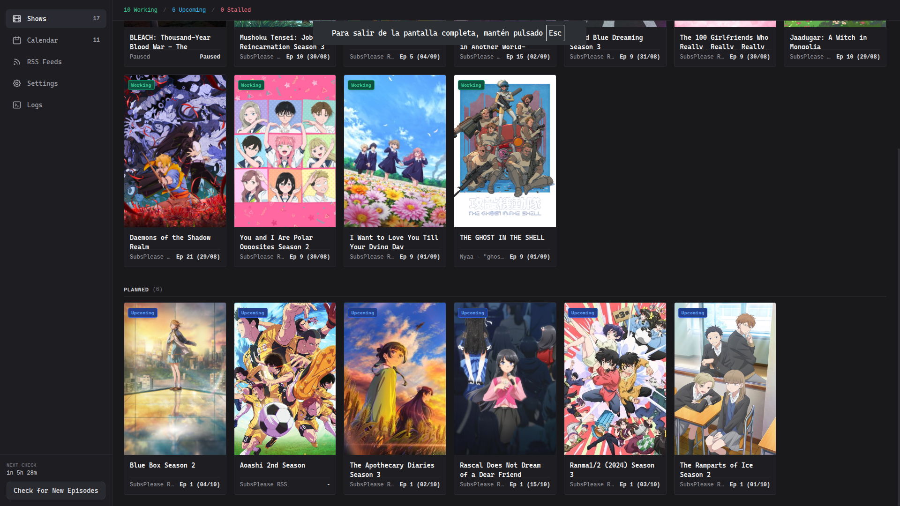
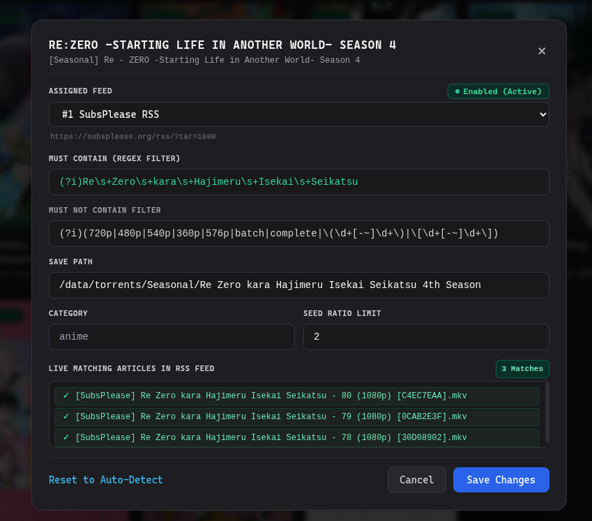
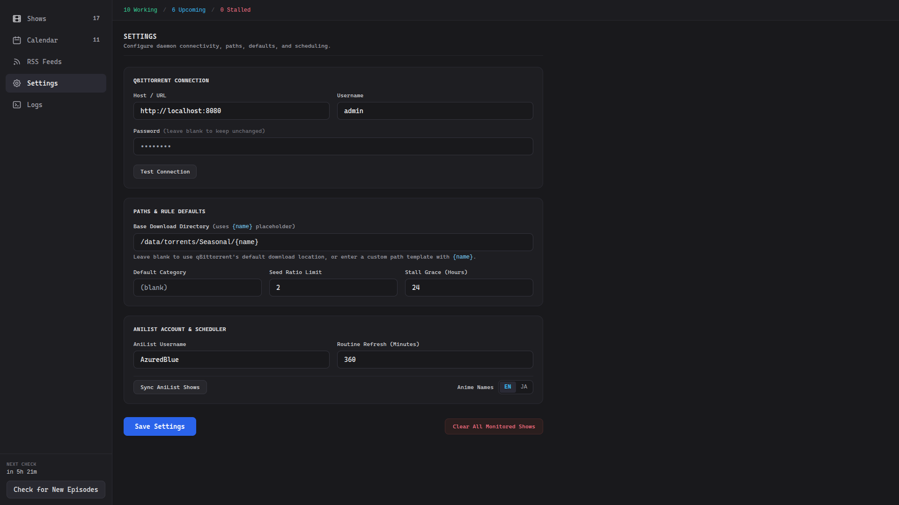
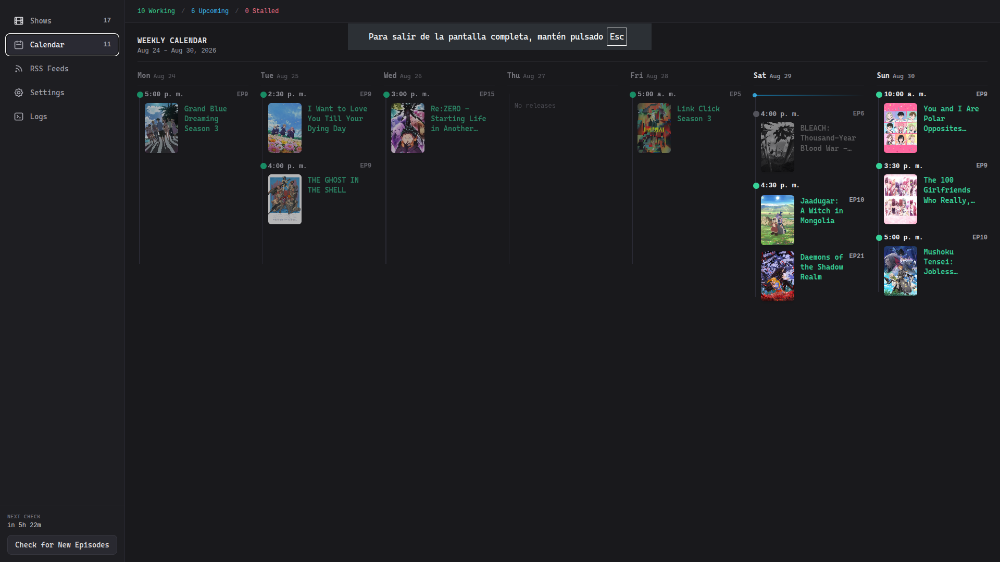

# qbit-seasonal-anime

A script that helps you manage your seasonal anime's RSS download rules automatically.

This script is managed by default using `http://localhost:8085`. 

## Images

<div align="center">

| Dashboard | Editing |
|:---:|:---:|
|  |  |
| Settings | Calendar |
|  |  |
</div>

--- 

## Features
- **AniList Sync**: Automatically imports your seasonal anime watchlist.
- **RSS Feeds Ranking**: Give priority to certain RSS Feeds for downloading your seasonal anime. Fallsback automatically to other feeds if not found.
- **qBittorrent RSS Automation**: Automatically manages your qBittorrent auto-downloader rules for your seasonal anime.
- **Calendar**: Creates a calendar for your seasonal anime.

---

## Installation

### Option 1:  `pipx` (Easiest)
```bash
pipx install git+https://github.com/AzuredBlue/qbit-seasonal-anime.git

# Run directly from anywhere
qbit-seasonal-anime
```

### Option 2: Clone & Run
```bash
git clone https://github.com/AzuredBlue/qbit-seasonal-anime.git
cd qbit-seasonal-anime

python3 -m venv .venv
source .venv/bin/activate
pip install -e .

# Run:
qbit-seasonal-anime
```

---

## Usage

After running it, you can open **`http://localhost:8085`** in your browser, where you can change some settings like the base download directory and connecting with your AniList and qBit.

After syncing with your AniList and making sure it can connect to qBit's WebUI, it will automatically create RSS Download Rules for each seasonal show. Once a show airs, it will automatically check for the best release (based on your RSS feed ranking) and adjust the RSS Download Rule so it matches it.

It is recommended to run this script on startup instead of launching it manually, you can do this on Windows by creating a `shortcut` that runs in on the `startup` folder or with a `systemd service` on Linux.
